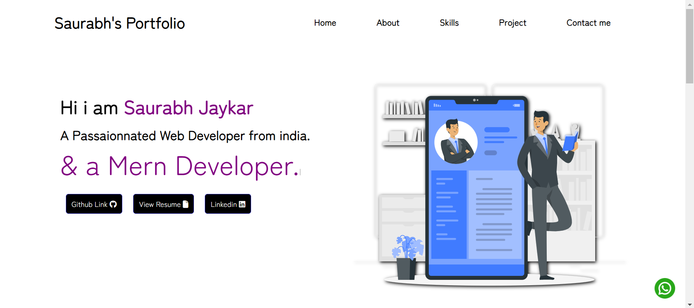
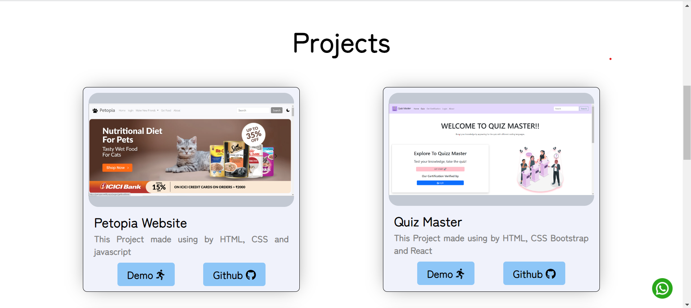
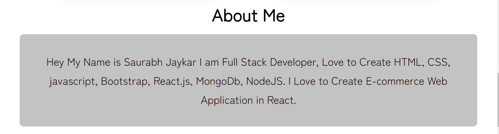
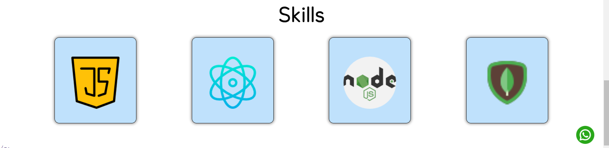

# [Saurabh's Portfolio](https://sau16-port.netlify.app/)💡 
## Hey Welcome to My Portfolio 🐱‍🚀

I have created a personal portfolio with the help of `**html5, css3**`, and the personal portfolio was fully responsive to all screen's 🌈😀🎨

<!-- OL -->
## Features

1. Live Project Demo
1. Smooth Navigation
1. Responsive Design
1. Github Hosted 

# Home Page

# Project Page

# About Page

# Skills Page

